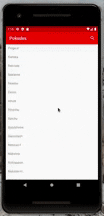
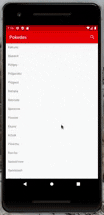

# Android - Pokédex
> An android app that allows users to search up search up their favourite pokémon and get their corresponding type, id, and description.

> This project was made to showcase my ability to apply aspects of object oriented programing and MVC to create an end product

## Table of Contents
* [Requirements](#requirements)
* [How it works](#how-it-works)

## Requirements
* Android Lolipop (5) or higher
* 7 Mb of available internal storate

## How it works...
### Scroll to find pokemon

### Or use the search feature

[Youtube Demo](https://youtu.be/jO8Q7Gc2fUM "Pokedex Demo")

__Please feel to connect with me on LinkedIn, I'd love to chat about project ideas, software enginnering internships, or anything related to tech!__

[My LinkedIn profile](https://www.linkedin.com/in/tmrahman/ "LinkedIn Profile")
